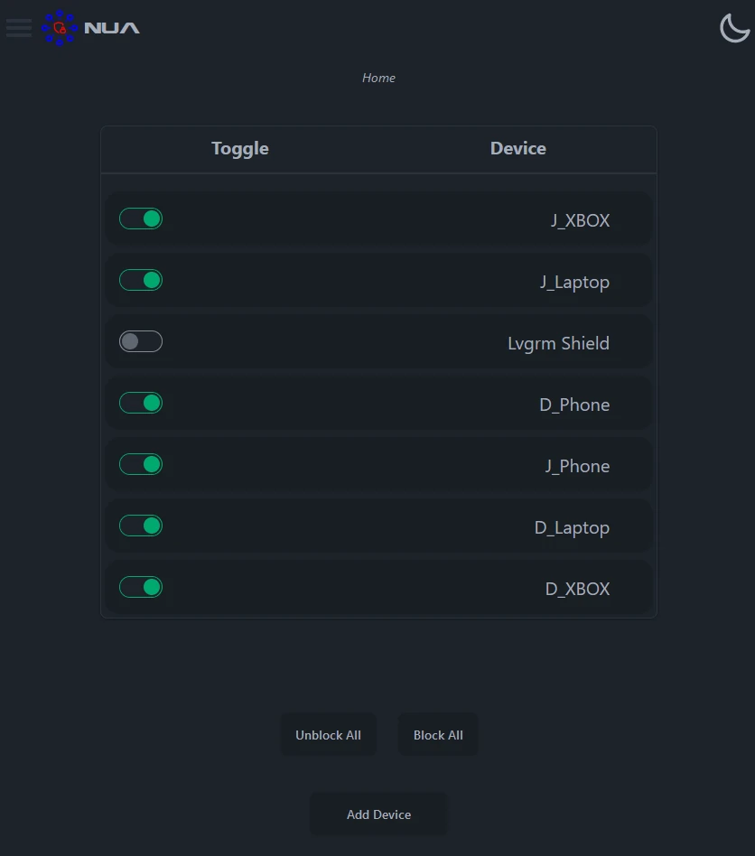
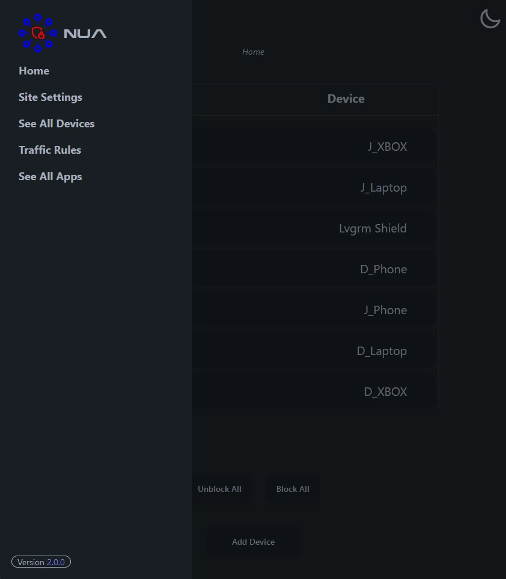
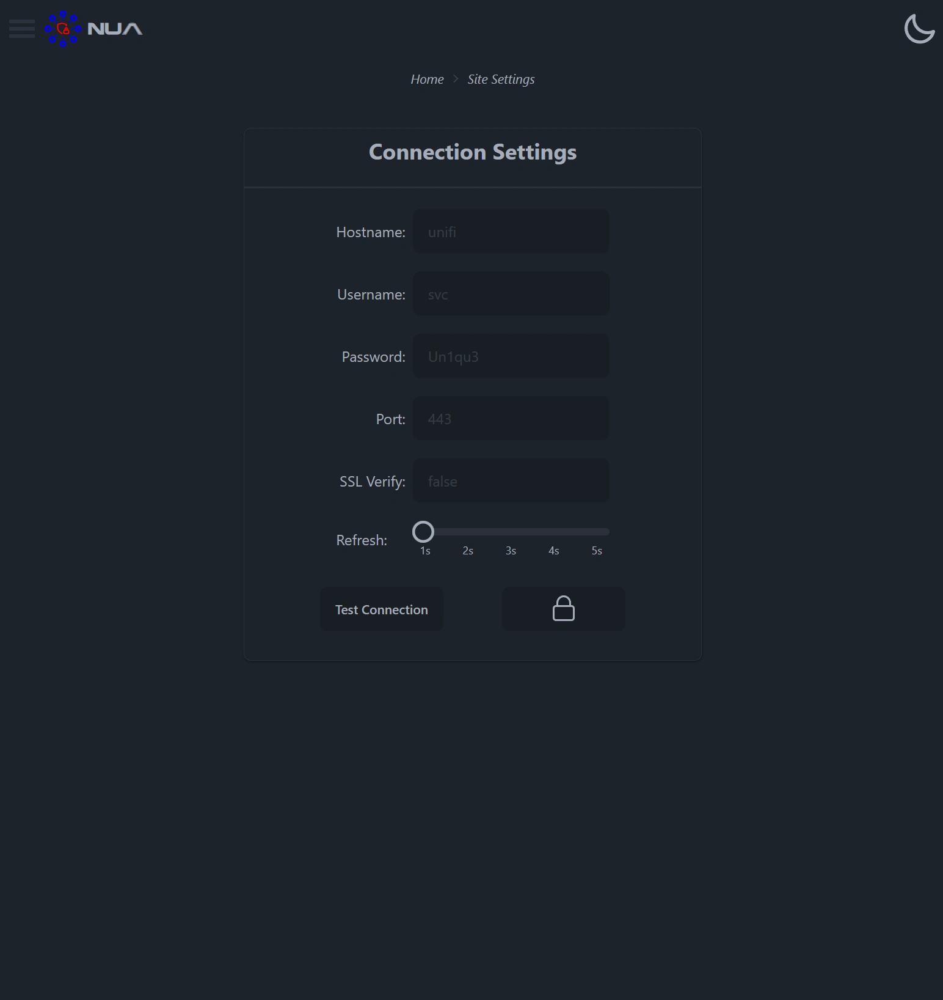
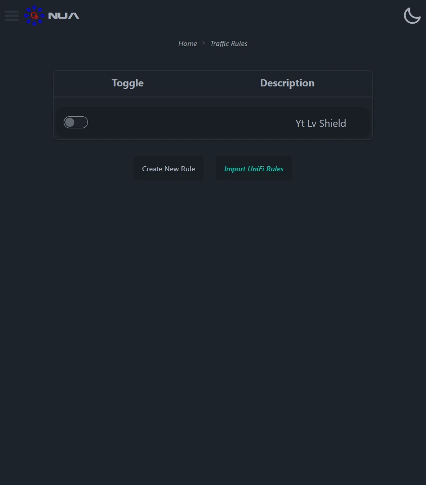

NUA is a NodeJS-based web application designed to simplify device management on UniFi networks. This intuitive tool offers an easy-to-use web interface, empowering you to effortlessly block and unblock devices within your UniFi network.

This software only works with [UniFi Cloud Gateways](https://ui.com/us/en/cloud-gateways).

## Features
* ✨ **Intuitive Web Interface**: Enjoy a simple and easy-to-use web interface that streamlines the device management process.
* 🔒 **Device Blocking**: Take control of your network by blocking specific devices, ensuring a distraction-free environment or enforcing necessary restrictions.
* 🔒 **App Blocking**: Block specific apps and websites.
* ⌚ **Easy Schedules**: Leverage the built-in scheduler to automate device management tasks. Schedule device blocking for specific time slots, creating a structured environment.
* 👨‍👩‍👧‍👦 **Parental Controls**: Use NUA as a robust parental control tool. Set device time limits or enforce restrictions until chores are completed, promoting a healthy balance of technology usage.

## Screenshot

|                                       |                                       |
|:-------------------------------------:|:-------------------------------------:|
|  ||
|  ||

## Install & Configure
### Preferred: Run Docker Image
See docker repo [here](https://hub.docker.com/r/artimusmaximus/nua/tags)

### Alternative: Run using Node
[Check the NUA installation Wiki](https://github.com/ArtimusMaximus/NUA/wiki/Install-and-Start-Using-Node)

## Wiki
[Check the Wiki](https://github.com/ArtimusMaximus/NUA/wiki)

# Support
If you encounter issues with NUA, follow these steps before reporting a bug:
* Update to the latest version of NUA.
* Turn the device off and on again.
* Use the search function to check if this issue has already been reported or resolved.
* [Check the Wiki](https://github.com/ArtimusMaximus/NUA/wiki)

Following these steps can help address common problems and ensure that you are using the latest version of NUA. If the issue persists, consider reporting it to the appropriate channels.

# Feature Requests
1. **Check the Issues Tracker**:

    Before submitting a new feature request, check the issues tracker to see if someone else has already requested a similar feature.

2. **Thumbs Up for Similar Ideas**:

    If you find a similar feature request, give it a thumbs up to show your support. Avoid adding comments like +1, as it can create unnecessary spam.

By adhering to these guidelines, you contribute to a more organized and streamlined feature request process. Your input is valuable in shaping the future development of the software.

# Warning
This software comes with the following warnings:

1. Not for production use:

    This software should not be used in a production environment. It may not have undergone sufficient testing or validation for reliable production use.

2.  This app should not be directly accessible from the internet :

    Ensure that this software is not accessible from the internet. Exposing it to the internet may pose security risks. Limit its usage to controlled and secure environments.

3. Use at your own risk:

    The use of this software is at your own risk. The developers do not guarantee its performance, security, or suitability for any specific purpose. Exercise caution and consider potential risks before deploying or using this software.

# License
This software is released under the GNU Lesser General Public License version 3 (LGPL v3), an open-source license. You are free to use, modify, and distribute the software as you see fit. However, any modifications you make to the software must also be open-sourced under the same LGPL v3 license.

For more details about the LGPL v3 license, please refer to the [GNU Lesser General Public License version 3](https://www.gnu.org/licenses/lgpl-3.0.en.html).
