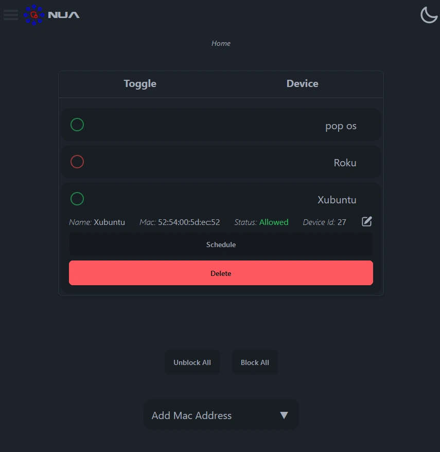

# NUA

NUA intended provides you with a easy-to-use web interface for blocking and unblocking Unifi network clients.

## Features
* Add/Remove Unifi clients for management using a MAC address.
* Block or unblock all managed clients with a single click.
* Schedule to block or unblock managed clients via a cron scheduler.

## Screenshot



## Install & Configure
Install Node using Node Version Manager
```bash
curl -o- https://raw.githubusercontent.com/nvm-sh/nvm/v0.39.3/install.sh | bash
```

This will install the nvm script to your user account. To use it, you must source your `.bashrc` file:

```bash
source ~/.bashrc
```

Now, you can ask NVM which versions of Node are available:

```bash
nvm list-remote
```

We're going to use Node v18+:

```bash
nvm install v18.18.1
```

You can now verify that we're using the correct version of Node:
```bash
node -v
nvm list
```

Install prerequisite Linux packages
```bash
sudo apt -y install git
```

Clone this repository:

```bash
git clone git@github.com:ArtimusMaximus/nodeunifireact.git
```

Install Node prerequisites:

```bash
cd nodeunifireact
npm install
npm install nodemon
```


### Optional - Set the port number
The default port is 4322. If you'd like to change the port, create the `globalSettings.js` file using the existing template:

```bash
cp server/globalSettings.js.template server/globalSettings.js
```

Now change the `<port>` string to your port number:

```js
const customPORT = 5000;


module.exports = customPORT;
```

## Start NUA Software

```bash
npm run start
```