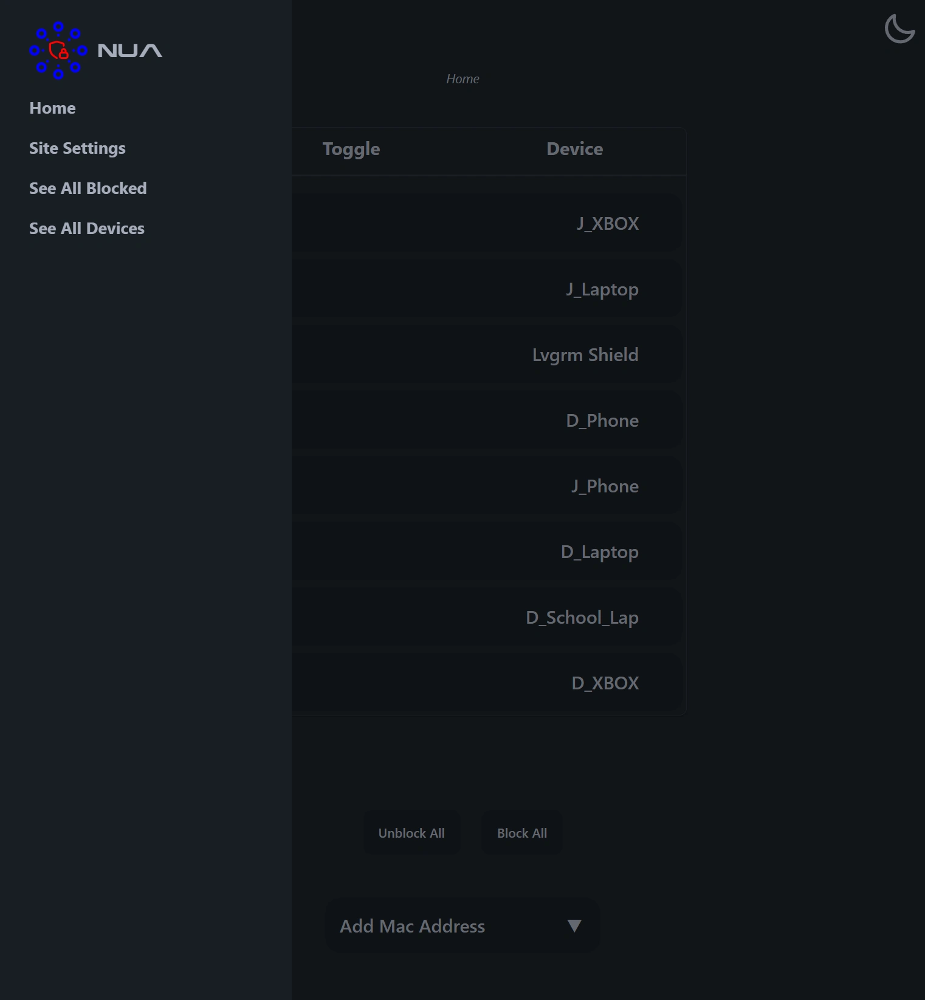
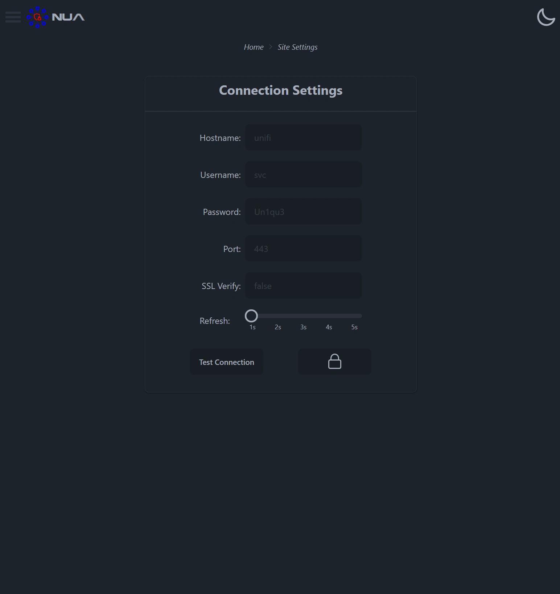
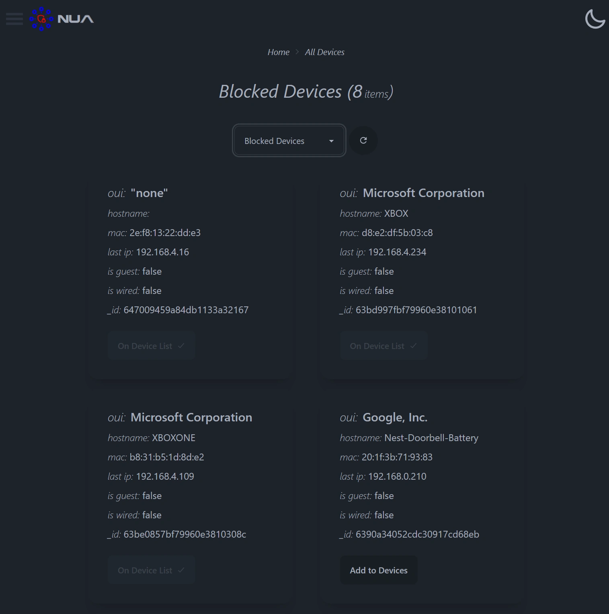
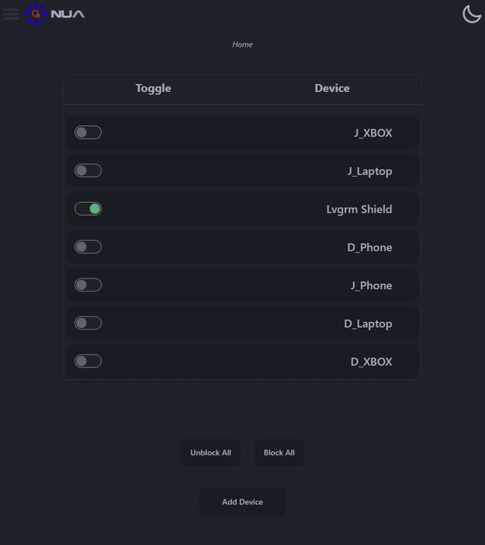

NUA is a NodeJS-based web application designed to simplify device management on UniFi networks. This intuitive tool offers an easy-to-use web interface, empowering you to effortlessly block and unblock devices within your UniFi network.

This software only works with [UniFi Cloud Gateways](https://ui.com/us/en/cloud-gateways).

## Features
* ✨ **Intuitive Web Interface**: Enjoy a simple and easy-to-use web interface that streamlines the device management process.
* 🔒 **Device Blocking**: Take control of your network by blocking specific devices, ensuring a distraction-free environment or enforcing necessary restrictions.
* ⌚ **Cron Scheduler**: Leverage the built-in cron scheduler to automate device management tasks. Schedule device blocking for specific time slots, creating a structured environment.
* 👨‍👩‍👧‍👦 **Parental Controls**: Use NUA as a robust parental control tool. Set device time limits or enforce restrictions until chores are completed, promoting a healthy balance of technology usage.

## Screenshot

|                                       |                                       |
|:-------------------------------------:|:-------------------------------------:|
|  ||
|  ||




## Install & Configure
### Install Node using Node Version Manager
1. Run the following command to download and install Node Version Manager (NVM):
```bash
curl -o- https://raw.githubusercontent.com/nvm-sh/nvm/v0.39.3/install.sh | bash
```
This installs the NVM script to your user account.

2. Source your `.bashrc` file to activate NVM:

```bash
source ~/.bashrc
```

3. Check available Node versions:

```bash
nvm list-remote
```

4. Choose Node v18+ and install it:

```bash
nvm install v18.18.1
```

5. Verify the installed Node version:
```bash
node -v
```
or 
```bash
nvm list
```

### Install prerequisite Linux packages
1. Install Git:
```bash
sudo apt -y install git
```

2. Clone the repository:

```bash
git clone git@github.com:ArtimusMaximus/nodeunifireact.git
```

### Install Node frontend prerequisites
1. Navigate to the project directory

```bash
cd nodeunifireact
```

2. Install frontend Node prerequisites:
```bash
npm install
```

### Install Node server prerequisites
1. Navigate to the server directory:
```bash
cd server
```

2. Install server Node prerequisites:
```bash
npm install
```

### Initiate Prisma DB
1. Run the following command from inside `server` directory:
```bash
npm run db
```

### Build NUA frontend
1. Navigate back to the main project directory:
```bash
cd ../
```
2. Build the NUA frontend:
```bash
npm run build
```

### Optional - Set the port number
If you want to change the default port (4323):
1. Open `<repo>/server/globalSettings.js`:


Now change the `4323` string to your desired port number:

```js
const customPORT = 5000;


module.exports = customPORT;
```

## Start NUA Software
To start NUA, follow these steps:

1. Navigate to the `nodeunifireact/server` directory:
```bash
cd server
```

2. Run the following command to start NUA:
```bash
npm run start
```
This will initiate the NUA software. Make sure to check the console for any logs or messages to ensure that NUA has started successfully.

## How do I run this in the background/autostart?
[Check out this pm2 documentation](https://pm2.keymetrics.io/docs/usage/quick-start/)

## Wiki
[Check the Wiki](https://github.com/ArtimusMaximus/NUA/wiki)

# Support
If you encounter issues with NUA, follow these steps before reporting a bug:
* Update to the latest version of NUA.
* Turn the device off and on again.
* Use the search function to check if this issue has already been reported or resolved.
* [Check the Wiki](https://github.com/ArtimusMaximus/NUA/wiki)

Following these steps can help address common problems and ensure that you are using the latest version of NUA. If the issue persists, consider reporting it to the appropriate channels.

# Feature Requests
1. **Check the Issues Tracker**:

    Before submitting a new feature request, check the issues tracker to see if someone else has already requested a similar feature.

2. **Thumbs Up for Similar Ideas**:

    If you find a similar feature request, give it a thumbs up to show your support. Avoid adding comments like +1, as it can create unnecessary spam.

By adhering to these guidelines, you contribute to a more organized and streamlined feature request process. Your input is valuable in shaping the future development of the software.  

# Warning
This software comes with the following warnings:

1. Not for production use:

    This software should not be used in a production environment. It may not have undergone sufficient testing or validation for reliable production use.

2.  No internet accessibility:

    Ensure that this software is not accessible from the internet. Exposing it to the internet may pose security risks. Limit its usage to controlled and secure environments.

3. Use at your own risk:

    The use of this software is at your own risk. The developers do not guarantee its performance, security, or suitability for any specific purpose. Exercise caution and consider potential risks before deploying or using this software. 

# License
This software is released under the GNU Lesser General Public License version 3 (LGPL v3), an open-source license. You are free to use, modify, and distribute the software as you see fit. However, any modifications you make to the software must also be open-sourced under the same LGPL v3 license.

For more details about the LGPL v3 license, please refer to the [GNU Lesser General Public License version 3](https://www.gnu.org/licenses/lgpl-3.0.en.html).
